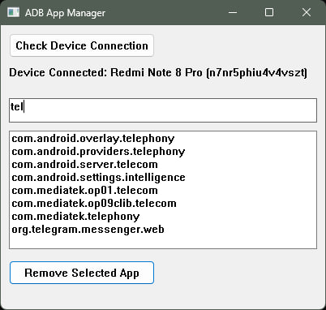

# ADB App Manager

ADB App Manager is a lightweight, Rust-based desktop application with a simple native Windows GUI. This application allows users to manage installed Android apps on a connected device through ADB (Android Debug Bridge). Users can view, filter, and uninstall apps directly from their PC using this tool.



## Features

- **View Installed Apps**: Easily list all apps installed on your connected Android device.
- **Filter Apps**: Use the search box to filter the list of apps by name.
- **Uninstall Apps**: Select an app from the list and remove it from your device with a simple click.
- **Native Windows UI**: Built using [native-windows-gui](https://github.com/gabdube/native-windows-gui) in Rust, the app features a simple and efficient user interface.

---

## ⚠️ Important Warning

This tool allows you to uninstall any app on your Android device, including **system apps**. Removing system apps can cause instability or permanently damage your device. Please use this tool responsibly and understand the risks involved. **The developer is not responsible for any damage caused to your device by using this tool.**

**Use at your own risk!**

---

## Prerequisites

### Enable Developer Mode and USB Debugging on Your Android Device

Before using the ADB App Manager, you need to enable Developer Mode and USB Debugging on your Android device:

1. **Enable Developer Mode**:
   - Open the **Settings** app on your phone.
   - Scroll down and tap **About phone**.
   - Find the **Build number** and tap it 7 times until you see a message that Developer Mode is enabled.

2. **Enable USB Debugging**:
   - Go to **Settings** > **Developer options**.
   - Scroll down and enable **USB debugging**.
   - Connect your Android device to your computer via a USB cable.

---

## How to Run the ADB App Manager

1. **Download the Prebuilt Executable**:
   - Download the zip file from the [Releases](https://github.com/Sinamirshahi/adb_for_dad/releases) section.

2. **Extract the Zip File**:
   - Extract the downloaded zip file to a folder on your computer.

3. **Run the Application**:
   - Navigate to the extracted folder and run `adb_app_manager.exe`.
   - Ensure that your Android device is connected via USB with USB Debugging enabled.

4. **Managing Apps**:
   - Once the app detects your device, it will list all installed apps.
   - You can filter the apps by typing in the search box.
   - Select an app and click **Remove Selected App** to uninstall it.

### Sample App Removal

To remove an app like *com.example.app*:

1. Connect your device via USB and ensure USB debugging is enabled.
2. Run `adb_app_manager.exe`.
3. Use the search bar to locate the app by typing "example".
4. Select the app from the list.
5. Click the **Remove Selected App** button.
6. Confirm the uninstallation in the popup dialog.

---

## Running the App from Source

If you want to build and run the app from source code, follow these steps:

1. **Clone the Repository**:
   ```bash
   git clone https://github.com/Sinamirshahi/adb_for_dad.git
   cd adb_app_manager
   ```

2. **Install Rust**:
   Ensure you have [Rust](https://www.rust-lang.org/tools/install) installed on your system.

3. **Build the Project**:
   ```bash
   cargo build --release
   ```

4. **Run the Application**:
   The compiled executable will be located in the `target/release/` directory:
   ```bash
   cargo run --release
   ```

---

## Potential Risks

By using this tool, you might accidentally uninstall important system apps. **Exercise caution** when selecting apps for removal, as some apps are critical for the functioning of your Android device. If unsure, avoid removing system or pre-installed apps.

---

## License

This project is open-source and available under the [MIT License](LICENSE).

---

## Contributions

Feel free to open issues or contribute to the project by submitting pull requests!

---

### **Download Link**

[Download ADB App Manager from Releases](https://github.com/Sinamirshahi/adb_for_dad/releases)
